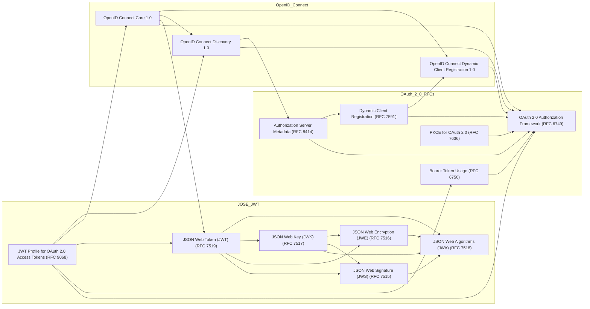

# OpenID Connect and OAuth Specification Graph

This repository contains a visual representation of the relationships between OpenID Connect, OAuth 2.0, and related specifications including JWT (JSON Web Token) and JOSE (JSON Web Signature/Encryption) standards.

## Overview

The modern web authentication and authorization ecosystem is built on a foundation of interconnected specifications. Understanding how these specifications relate to and depend on each other is crucial for developers implementing secure authentication systems. This diagram visualizes these relationships in an easy-to-understand format.

## What's Included

The diagram shows the dependency relationships between:

- **OAuth 2.0 RFCs**: Core authorization framework and extensions
- **JOSE/JWT Standards**: Cryptographic foundations for secure tokens
- **OpenID Connect**: Identity layer built on top of OAuth 2.0

Each node in the graph is clickable and links directly to the official specification document.

## Specification Graph

## Specification Categories

### OAuth 2.0 Foundation

- **RFC 6749** - OAuth 2.0 Authorization Framework: The core OAuth 2.0 specification
- **RFC 6750** - Bearer Token Usage: Defines how to use bearer tokens in HTTP requests
- **RFC 7636** - PKCE: Proof Key for Code Exchange, security extension for public clients
- **RFC 7591** - Dynamic Client Registration: Allows clients to register themselves with authorization servers
- **RFC 8414** - Authorization Server Metadata: Standardizes discovery of authorization server capabilities

### JOSE/JWT Security

- **RFC 7515** - JSON Web Signature (JWS): Digital signature format for JSON
- **RFC 7516** - JSON Web Encryption (JWE): Encryption format for JSON
- **RFC 7517** - JSON Web Key (JWK): Format for representing cryptographic keys in JSON
- **RFC 7518** - JSON Web Algorithms (JWA): Cryptographic algorithms for JOSE
- **RFC 7519** - JSON Web Token (JWT): Compact, URL-safe means of representing claims
- **RFC 9068** - JWT Profile for OAuth 2.0 Access Tokens: Standardizes JWT-based access tokens

### OpenID Connect Identity Layer

- **OpenID Connect Core 1.0**: Main specification defining the identity layer on top of OAuth 2.0
- **OpenID Connect Discovery 1.0**: Mechanism for discovering OpenID Connect provider configuration
- **OpenID Connect Dynamic Client Registration 1.0**: Extension for dynamic client registration in OIDC context

## Understanding the Dependencies

The arrows in the diagram show how specifications build upon each other:

1. **OAuth 2.0 Forms the Base**: Most specifications extend or reference RFC 6749
2. **JOSE Provides Cryptographic Foundations**: JWT and related specs depend on JOSE for security
3. **OpenID Connect Builds on Both**: OIDC uses OAuth 2.0 for authorization and JWT for identity tokens
4. **Modern Extensions**: Newer specifications like RFC 9068 integrate multiple existing standards

## Usage

This diagram is useful for:

- **Developers** implementing OAuth 2.0 or OpenID Connect
- **Security architects** designing authentication systems
- **Students** learning about web authentication standards
- **Technical writers** documenting authentication flows

## Viewing the Diagram

The diagram renders automatically on GitHub. For local viewing or editing:

1. Use any Mermaid-compatible viewer or editor
2. Copy the Mermaid code into [Mermaid Live Editor](https://mermaid.live/)
3. Use VS Code with the Mermaid extension for local editing

## Contributing

If you notice missing specifications or incorrect dependencies, please open an issue or submit a pull request. When adding new specifications, please:

1. Verify the dependency relationships by reading the actual specification documents
2. Add clickable links to official specification sources
3. Update the specification categories section in this README

## License

This repository is available under The Unlicense. See the [LICENSE](LICENSE) file for details.

## Additional Resources

- [OAuth 2.0 Security Best Current Practice](https://datatracker.ietf.org/doc/html/draft-ietf-oauth-security-topics)
- [OpenID Connect Documentation](https://openid.net/connect/)
- [IANA OAuth Parameters Registry](https://www.iana.org/assignments/oauth-parameters/oauth-parameters.xhtml)
