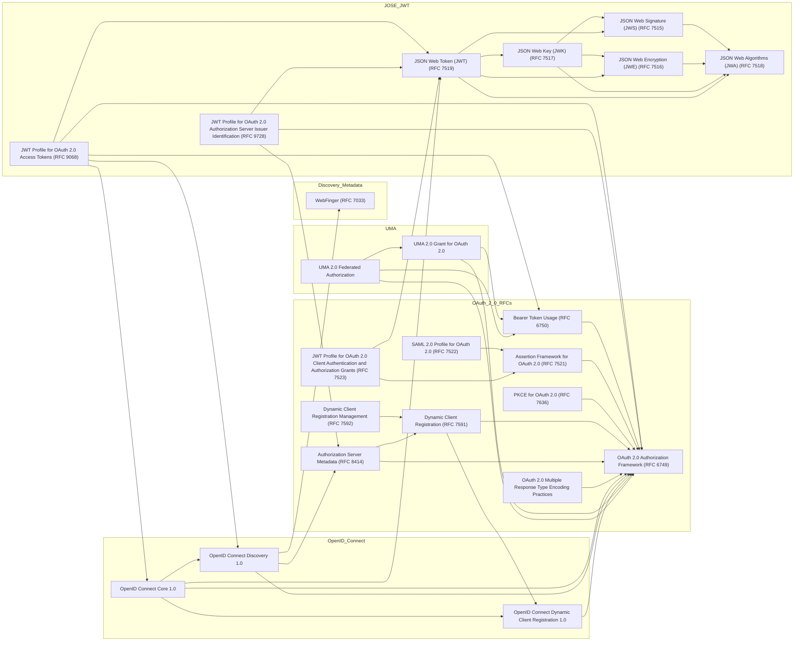

# OpenID Connect and OAuth Specification Graph

```mermaid
graph LR

  %% --- OpenID Connect ---
  subgraph OpenID_Connect
    OIDC_Core["OpenID Connect Core 1.0"]
    OIDC_Discovery["OpenID Connect Discovery 1.0"]
    OIDC_Reg["OpenID Connect Dynamic Client Registration 1.0"]
  end

  %% --- OAuth 2.0 RFCs ---
  subgraph OAuth_2_0_RFCs
    RFC6749["OAuth 2.0 Authorization Framework (RFC 6749)"]
    RFC6750["Bearer Token Usage (RFC 6750)"]
    RFC7521["Assertion Framework for OAuth 2.0 (RFC 7521)"]
    RFC7522["SAML 2.0 Profile for OAuth 2.0 (RFC 7522)"]
    RFC7523["JWT Profile for OAuth 2.0 Client Authentication and Authorization Grants (RFC 7523)"]
    RFC7636["PKCE for OAuth 2.0 (RFC 7636)"]
    RFC7591["Dynamic Client Registration (RFC 7591)"]
    RFC7592["Dynamic Client Registration Management (RFC 7592)"]
    RFC8414["Authorization Server Metadata (RFC 8414)"]
    OAuth2_MultiResp["OAuth 2.0 Multiple Response Type Encoding Practices"]
  end

  %% --- JOSE / JWT ---
  subgraph JOSE_JWT
    RFC7515["JSON Web Signature (JWS) (RFC 7515)"]
    RFC7516["JSON Web Encryption (JWE) (RFC 7516)"]
    RFC7517["JSON Web Key (JWK) (RFC 7517)"]
    RFC7518["JSON Web Algorithms (JWA) (RFC 7518)"]
    RFC7519["JSON Web Token (JWT) (RFC 7519)"]
    RFC9068["JWT Profile for OAuth 2.0 Access Tokens (RFC 9068)"]
    RFC9728["JWT Profile for OAuth 2.0 Authorization Server Issuer Identification (RFC 9728)"]
  end

  %% --- Discovery / Metadata ---
  subgraph Discovery_Metadata
    RFC7033["WebFinger (RFC 7033)"]
  end

  %% --- UMA (User-Managed Access) ---
  subgraph UMA
    UMA_Grant["UMA 2.0 Grant for OAuth 2.0"]
    UMA_FedAuthz["UMA 2.0 Federated Authorization"]
  end

  %% ---- Edges: OAuth 2.0 internal references ----
  RFC6750 --> RFC6749
  RFC7521 --> RFC6749
  RFC7522 --> RFC7521
  RFC7523 --> RFC7521
  RFC7523 --> RFC7519
  RFC7636 --> RFC6749
  RFC7591 --> RFC6749
  RFC7592 --> RFC7591
  RFC8414 --> RFC6749
  RFC8414 --> RFC7591
  OAuth2_MultiResp --> RFC6749

  %% ---- Edges: OIDC depending on OAuth / JWT ----
  OIDC_Core --> RFC6749
  OIDC_Core --> RFC7519

  OIDC_Discovery --> RFC6749
  OIDC_Discovery --> RFC8414
  OIDC_Discovery --> RFC7033

  OIDC_Reg --> RFC6749
  %% RFC 7591 explicitly references OIDC Dynamic Client Registration
  RFC7591 --> OIDC_Reg

  %% ---- Edges: OIDC internal references ----
  OIDC_Core --> OIDC_Discovery
  OIDC_Core --> OIDC_Reg

  %% ---- Edges: JOSE internal references ----
  RFC7515 --> RFC7518
  RFC7516 --> RFC7518
  RFC7517 --> RFC7518
  RFC7517 --> RFC7515
  RFC7517 --> RFC7516

  %% ---- Edges: JWT depending on JOSE ----
  RFC7519 --> RFC7515
  RFC7519 --> RFC7516
  RFC7519 --> RFC7517
  RFC7519 --> RFC7518

  %% ---- Edges: newer JWT/OAuth profile referencing others ----
  RFC9068 --> RFC6749
  RFC9068 --> RFC6750
  RFC9068 --> RFC7519
  RFC9068 --> OIDC_Core
  RFC9068 --> OIDC_Discovery

  RFC9728 --> RFC6749
  RFC9728 --> RFC8414
  RFC9728 --> RFC7519

  %% ---- Edges: UMA depending on OAuth / JWT ----
  UMA_Grant --> RFC6749
  UMA_Grant --> RFC6750
  UMA_FedAuthz --> RFC6749
  UMA_FedAuthz --> RFC6750
  UMA_FedAuthz --> UMA_Grant

  %% ---- Clickable links for each node ----
  click RFC7033 "https://datatracker.ietf.org/doc/html/rfc7033" "WebFinger (RFC 7033)"

  click RFC6749 "https://datatracker.ietf.org/doc/html/rfc6749" "OAuth 2.0 Authorization Framework (RFC 6749)"
  click RFC6750 "https://datatracker.ietf.org/doc/html/rfc6750" "Bearer Token Usage (RFC 6750)"
  click RFC7521 "https://datatracker.ietf.org/doc/html/rfc7521" "Assertion Framework for OAuth 2.0 (RFC 7521)"
  click RFC7522 "https://datatracker.ietf.org/doc/html/rfc7522" "SAML 2.0 Profile for OAuth 2.0 (RFC 7522)"
  click RFC7523 "https://datatracker.ietf.org/doc/html/rfc7523" "JWT Profile for OAuth 2.0 Client Authentication and Authorization Grants (RFC 7523)"
  click RFC7636 "https://datatracker.ietf.org/doc/html/rfc7636" "PKCE (RFC 7636)"
  click RFC7591 "https://datatracker.ietf.org/doc/html/rfc7591" "Dynamic Client Registration (RFC 7591)"
  click RFC7592 "https://datatracker.ietf.org/doc/html/rfc7592" "Dynamic Client Registration Management (RFC 7592)"
  click RFC8414 "https://datatracker.ietf.org/doc/html/rfc8414" "Authorization Server Metadata (RFC 8414)"
  click OAuth2_MultiResp "https://openid.net/specs/oauth-v2-multiple-response-types-1_0.html" "OAuth 2.0 Multiple Response Type Encoding Practices"

  click RFC7515 "https://datatracker.ietf.org/doc/html/rfc7515" "JSON Web Signature (JWS) (RFC 7515)"
  click RFC7516 "https://datatracker.ietf.org/doc/html/rfc7516" "JSON Web Encryption (JWE) (RFC 7516)"
  click RFC7517 "https://datatracker.ietf.org/doc/html/rfc7517" "JSON Web Key (JWK) (RFC 7517)"
  click RFC7518 "https://datatracker.ietf.org/doc/html/rfc7518" "JSON Web Algorithms (JWA) (RFC 7518)"
  click RFC7519 "https://datatracker.ietf.org/doc/html/rfc7519" "JSON Web Token (JWT) (RFC 7519)"
  click RFC9068 "https://datatracker.ietf.org/doc/html/rfc9068" "JWT Profile for OAuth 2.0 Access Tokens (RFC 9068)"
  click RFC9728 "https://datatracker.ietf.org/doc/html/rfc9728" "JWT Profile for OAuth 2.0 Authorization Server Issuer Identification (RFC 9728)"

  click OIDC_Core "https://openid.net/specs/openid-connect-core-1_0.html" "OpenID Connect Core 1.0"
  click OIDC_Discovery "https://openid.net/specs/openid-connect-discovery-1_0.html" "OpenID Connect Discovery 1.0"
  click OIDC_Reg "https://openid.net/specs/openid-connect-registration-1_0.html" "OpenID Connect Dynamic Client Registration 1.0"

  click UMA_Grant "https://docs.kantarainitiative.org/uma/wg/rec-oauth-uma-grant-2.0.html" "UMA 2.0 Grant for OAuth 2.0"
  click UMA_FedAuthz "https://docs.kantarainitiative.org/uma/wg/rec-oauth-uma-federated-authz-2.0.html" "UMA 2.0 Federated Authorization"
```
